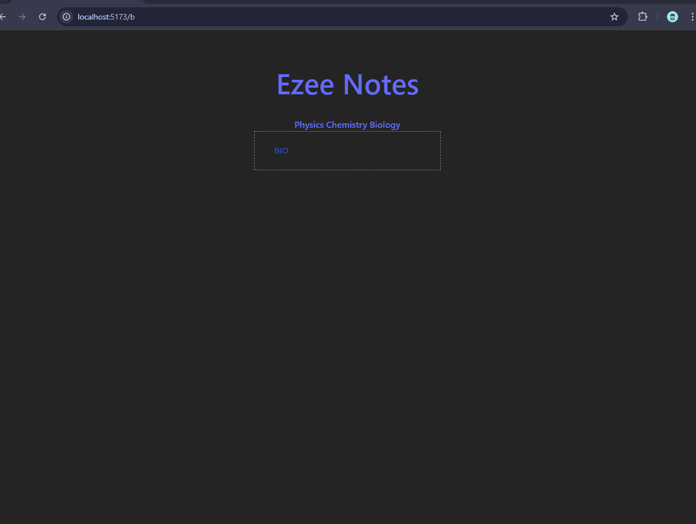

demo



```
 skills-dashboard
├──  .gitignore         # Root ignore file (crucial for node_modules & .env)
├──  README.md          # Project documentation & Git cheat sheet
├──  backend/           # Express.js + Node.js environment
│   ├──  config/        # DB connection strings, env variables setup
│   ├──  controllers/   # Route logic (the "brains" of your API)
│   ├──  models/        # Mongoose schemas (Database structure)
│   ├──  routes/        # API endpoints defining URLs
│   ├──  package.json   # Backend dependencies
│   └──  server.js      # Entry point for the backend API
└──  frontend/          # React JS environment
    ├──  public/        # Static public assets
    ├──  src/           # Main React code
    │   ├──  components/# Reusable UI pieces (Cards, Buttons, ProgBar)
    │   ├──  pages/     # Page-level components (Login, Dashboard, C12)
    │   ├──  styles/    # Custom CSS & layout files
    │   ├──  context/   # State management (if needed)
    │   └──  App.jsx    # Root React component
    └──  package.json   # Frontend dependencies
```

## Git Commit Cheat Sheet

This project follows the Conventional Commits standard to keep the Git history clean, readable, and professional.

When making a commit, use one of the following prefixes to categorize your work:

- **`feat:`** (Feature) Adding a brand new capability or component to the app.
  - _Example:_ `feat: add progress bar to chapter 12 quiz`
- **`fix:`** (Bug Fix) Squashing a bug or repairing broken logic.
  - _Example:_ `fix: correct state reset bug when changing card focus`
- **`ui:`** (User Interface) Visual changes using MUI or standard CSS.
  - _Example:_ `ui: update quiz button to use Duolingo green`
- **`style:`** (Formatting) Code structure changes that do not affect logic (spacing, missing semicolons, deleting empty lines).
  - _Example:_ `style: fix indentation in C12 component`
- **`refactor:`** (_Tahseen_ - Improvement) Rewriting a messy piece of code to make it cleaner or more efficient, while keeping the exact same functionality.
  - _Example:_ `refactor: simplify selectedIndex derived state logic`
- **`docs:`** (Documentation) Updates to this README, adding comments, or updating the SRS.
  - _Example:_ `docs: add commit cheat sheet to readme`
- **`chore:`** (Maintenance) Routine background tasks like installing new npm packages or updating configuration files.
  - _Example:_ `chore: install react-router-dom`
